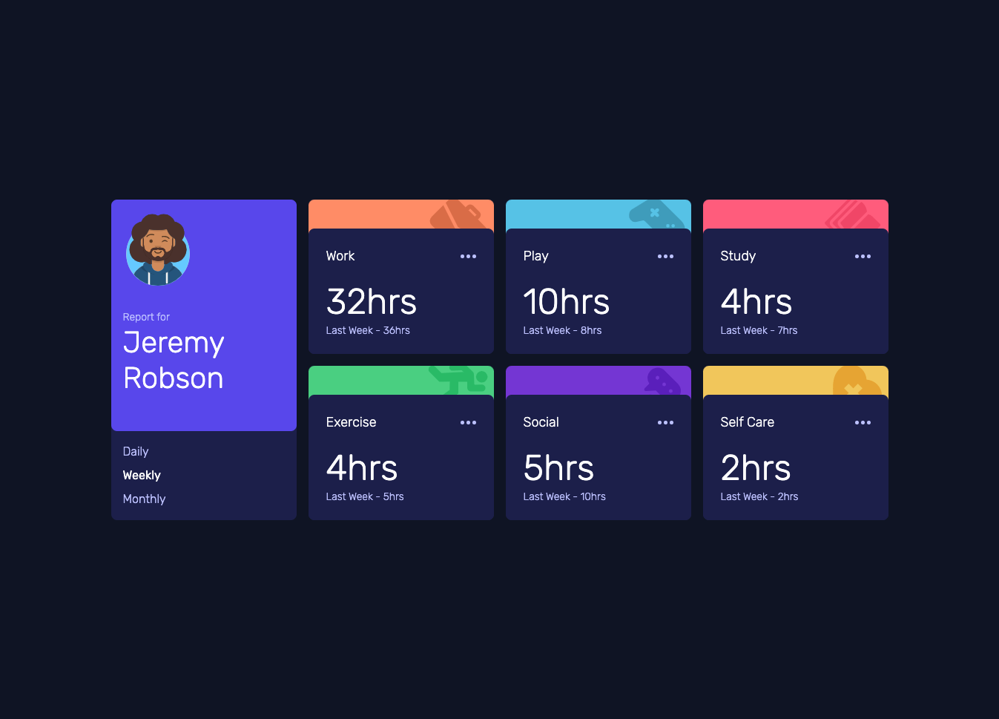

# Frontend Mentor - Time tracking dashboard solution

This is a solution to the [Time tracking dashboard challenge on Frontend Mentor](https://www.frontendmentor.io/challenges/time-tracking-dashboard-UIQ7167Jw). Frontend Mentor challenges help you improve your coding skills by building realistic projects.

## Table of contents

- [Frontend Mentor - Time tracking dashboard solution](#frontend-mentor---time-tracking-dashboard-solution)
  - [Table of contents](#table-of-contents)
  - [Overview](#overview)
    - [The challenge](#the-challenge)
    - [Screenshot](#screenshot)
    - [Links](#links)
  - [My process](#my-process)
    - [Built with](#built-with)
    - [What I learned](#what-i-learned)
    - [Useful resources](#useful-resources)
  - [Author](#author)

## Overview

### The challenge

Users should be able to:

- View the optimal layout for the site depending on their device's screen size
- See hover states for all interactive elements on the page
- Switch between viewing Daily, Weekly, and Monthly stats

### Screenshot

### Links

- Solution URL: [GitHub Repo](https://github.com/WeslleyNasRocha/time-tracking-dashboard-frontmentor)
<!-- - Live Site URL: [Add live site URL here](https://your-live-site-url.com) -->

## My process

### Built with

- Semantic HTML5 markup
- CSS custom properties
- Flexbox
- CSS Grid
- Mobile-first workflow
- [Svelte](https://svelte.dev/) - JS library
- [Sass](https://sass-lang.com/) - For styles

### What I learned

With this project i could practice more of the svelte framework, and how it can help me build more consise and lean web apps.

### Useful resources

- [The Svelte Docs](https://svelte.dev/docs) - Is a really nice documentation.
- [The Svelte Tutorial](https://svelte.dev/tutorial/basics) - It teaches how to build a very basic app, and how to use all the parts of the framework

## Author

- Frontend Mentor - [@WeslleyNasRocha](https://www.frontendmentor.io/profile/WeslleyNasRocha)
- GitHub - [@WeslleyNasRocha](https://www.github.com/WeslleyNasRocha)
- Twitter - [@ueslu](https://www.twitter.com/ueslu)
